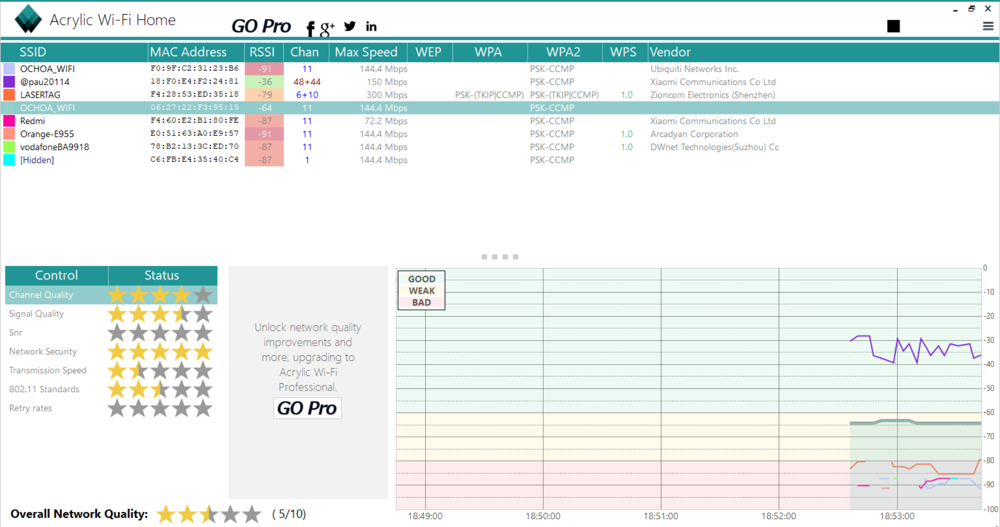
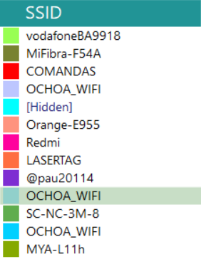
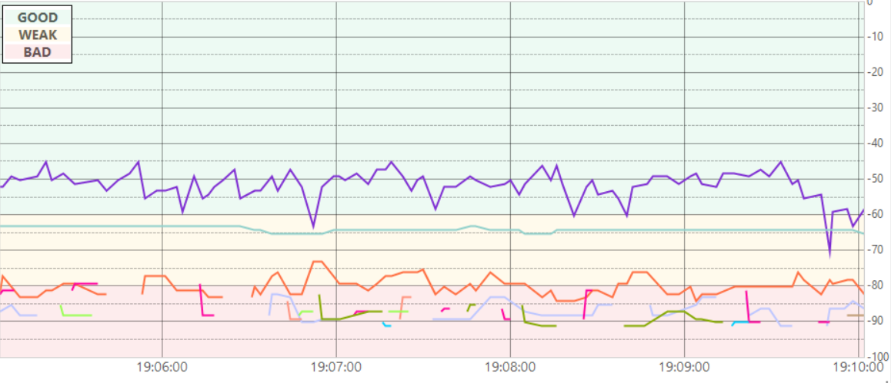
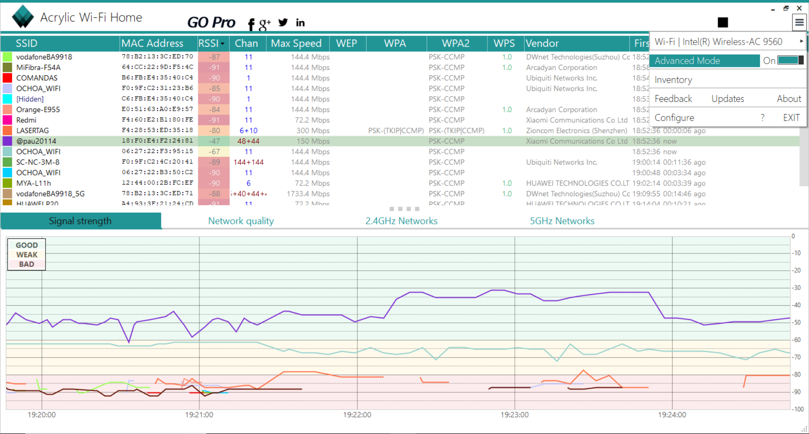
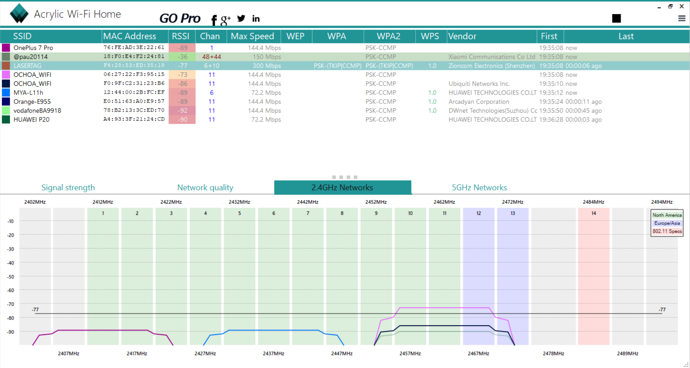

# Comprobación de señales WiFi
# MEDIR LA SEÑAL INLÁMBRICA CON Acrilyc WiFi Home

Vamos a usar dos programas distintos para realizar las comprobaciones, estos dos programas van a ser:

1. Wifi Analyzer
2. Acrylic WiFi Home

## Acrylic WiFi Home

Con este programa gratuito podemos visualizar la información WiFi en tiempo real, identificar problemas de canal, revisar la cobertura y mejorar el funcionamiento de la red WiFi.

Como vemos el programa es bastante gráfico en el primer bloque tenemos todos los nombres de las redes escaneadas **(SSID)**, las MAC de cada una de las redes **(MAC Address)**, la señal de la intensidad recibida **(RSSI)**, el canal **(Chan)**, la velocidad máxima a la que pueden ir estas redes **(Max Speed)**, las herramientas de cifrado** (WEP,WPA,WPA2)**, conexión automática **(WPS)** y el vendedor **(Vendor)**.

Si nos fijamos en la gráfica que teníamos en la página abajo a la derecha cada línea representa una red.

En la parte derecha tenemos la intensidad de la señal recibida de cada red (RSSI) como podemos observar tiene “3” rangos este programa del -60 a 0 que nos indica que la señal es buena, cuanto más cerca del 0 mejor será la intensidad, otro rango va del -80 al -60 que es una señal débil y por último del -100 al -80 que es una señal mala, esta señal puede verse afectada por paredes,muebles,cortinas,pilares,columnas...etc

Este programa tiene una opción avanzada para ver la gráfica de los canales, y el ancho de banda de los canales.

Como vemos tenemos los canales de las redes 2.4GHz que son 14 canales (en España solo podemos usar hasta el 13, ya que el 14 solo se puede utilizar en Japón) y como vemos tenemos 3 redes que están en el mismo canal que es el 11 por lo que tienen interferencias y la conexión de la red va a disminuir por eso si fuera nuestra red sería mejor cambiarlo de canal para que no tengamos interferencias y la conexión nos fuera mejor.

También vemos que tenemos las redes con un ancho de banda de 5GHz donde tenemos disponibles en España el uso de los canales del 36-64 y 100-140, como en el resto de Europa
