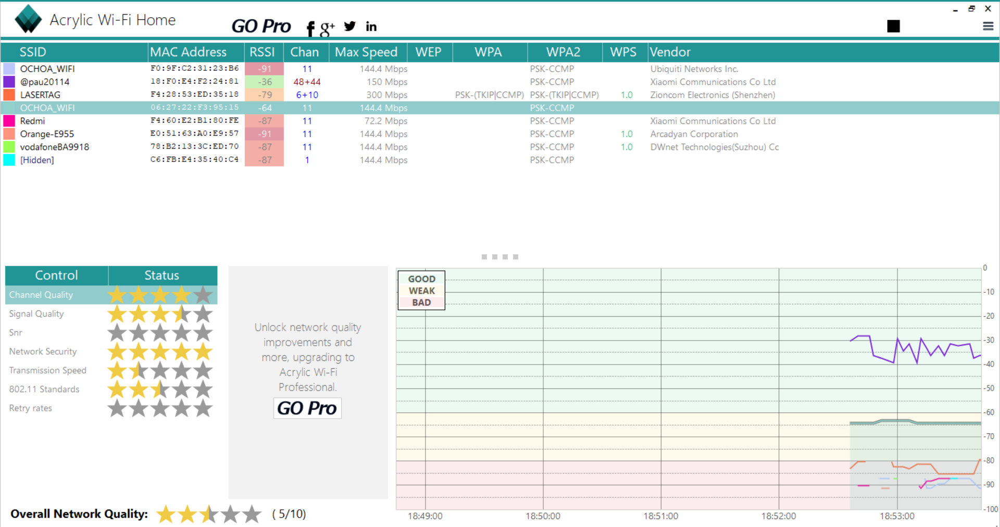
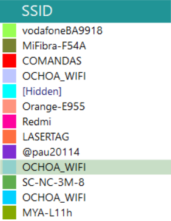
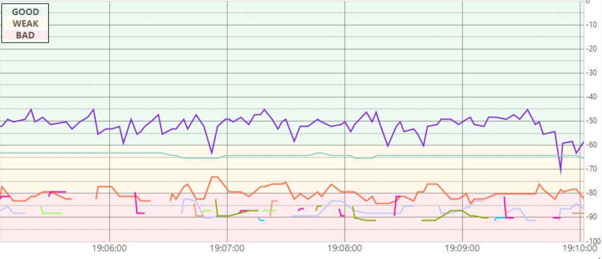
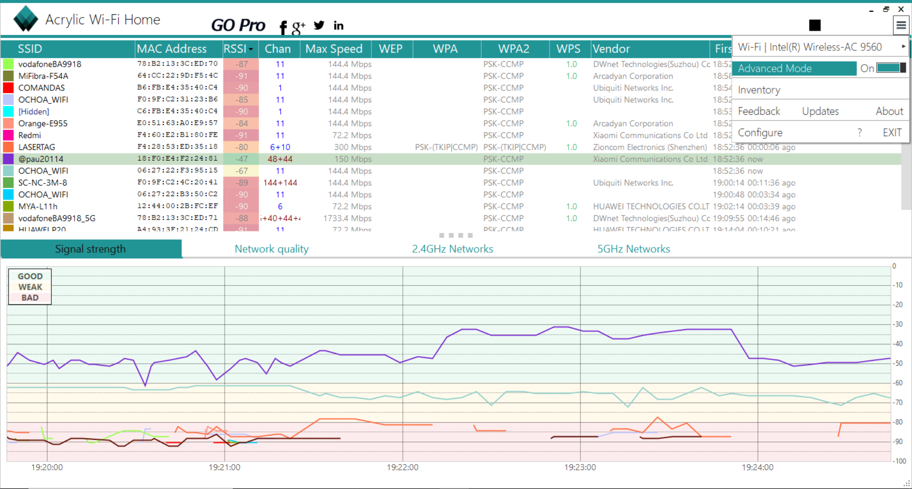
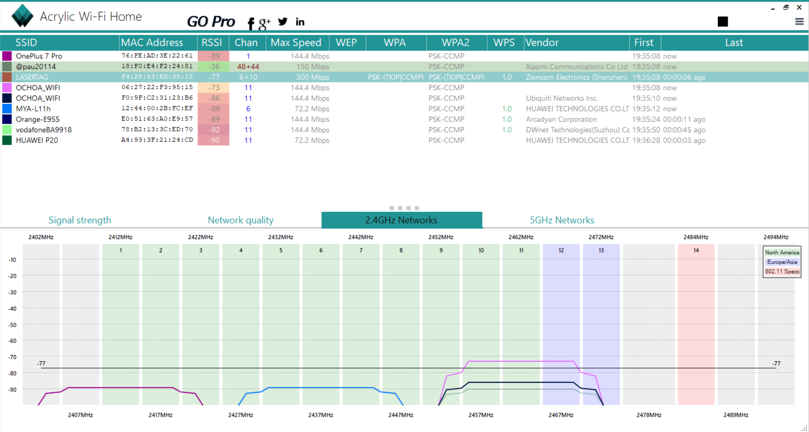

MEDIR LA SEÑAL INLÁMBRICA CON PROGAMAS

Vamos a usar dos programas distintos para realizar las comprobaciones, estos dos programas van a ser:

1.  Wifi Analyzer
2.  Acrylic WiFi Home

Acrylic WiFi Home

Con este programa gratuito podemos visualizar la información WiFi en tiempo real, identificar problemas de canal, revisar la cobertura y mejorar el funcionamiento de la red WiFi.

Como vemos el programa es bastante gráfico en el primer bloque tenemos todos los nombres de las redes escaneadas **(SSID)**, las MAC de cada una de las redes **(MAC Address)**, la señal de la intensidad recibida **(RSSI)**, el canal **(Chan)**, la velocidad máxima a la que pueden ir estas redes **(Max Speed)**, las herramientas de cifrado** (WEP,WPA,WPA2)**, conexión automática **(WPS)** y el vendedor **(Vendor)**.

Si nos fijamos en la gráfica que teníamos en la página abajo a la derecha cada línea representa una red.

En la parte derecha tenemos la intensidad de la señal recibida de cada red (RSSI) como podemos observar tiene “3” rangos este programa del -60 a 0 que nos indica que la señal es buena, cuanto más cerca del 0 mejor será la intensidad, otro rango va del -80 al -60 que es una señal débil y por último del -100 al -80 que es una señal mala, esta señal puede verse afectada por paredes,muebles,cortinas,pilares,columnas...etc

Este programa tiene una opción avanzada para ver la gráfica de los canales, y el ancho de banda de los canales.

Como vemos tenemos los canales de las redes 2.4GHz que son 14 canales y como vemos tenemos 3 redes que están en el mismo canal que es el 11 por lo que tienen interferencias y la conexión de la red va a disminuir por eso si fuera nuestra red sería mejor cambiarlo de canal para que no tengamos interferencias y la conexión nos fuera mejor.

